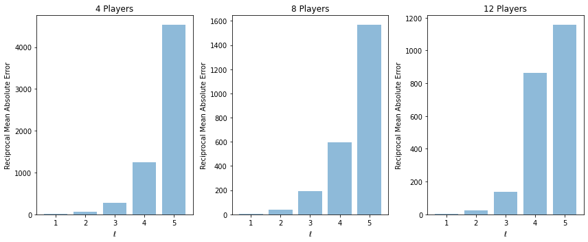

# Quantum Algorithms for Shapley Value Calculation

## Authors

<a href="https://github.com/iain-burge/iain-burge">Iain Burge</a>

<a href="https://carleton.ca/scs/people/michel-barbeau/">Michel Barbeau</a>

<a href="http://www-public.imtbs-tsp.eu/~garcia_a/web/">Joaquin Garcia-Alfaro</a>

## Resources

<a href="https://github.com/iain-burge/QuantumShapleyValueAlgorithm/tree/main/python/">Python Code</a>.

<a href="https://github.com/iain-burge/QuantumShapleyValueAlgorithm/tree/main/matlab/">Matlab Code</a>.

## Summary of Code and Results 

### One equation model

#### Construct the two quantum systems (may be combined in one)


Repeatedly measure the rightmost qubit.


** TODO **

### Random Voting Games & Quantum Shapley Values

The <a href="https://github.com/iain-burge/QuantumShapleyValueAlgorithm/tree/main/python/">python scripts under this folder</a>
address random voting games using our quantum algorithm to estimate the Shapley value of each player. The scripts also perform 
some basic data analysis on the predictions. A summary of the code and the results is shown below.

#### Import Libraries

``` python
import quantumBasicVotingGame as vg
from quantumShapEstimation import QuantumShapleyWrapper as qsw

import numpy as np
import matplotlib.pyplot as plt
import pickle
from tqdm.auto import tqdm
```
#### Define Variables

``` python
numTrails = 32

maxEll    = 7

#Defining the different conditions
numPlayersCond    = [4,8,12]
thresholdBitCond  = [4,5,6]
roughVarianceCond = [1,2,2]
```

#### Run Simulations

``` python
simulations = {}

for trialNum in tqdm(range(numTrails), desc="Current Trial"):
    for ell in tqdm(range(1,maxEll), desc="Current Ell"):
        for n, thresholdBits, roughVariance in zip(
            numPlayersCond, thresholdBitCond, roughVarianceCond
        ):
            trial = (n,ell,trialNum)


            #New random game
            threshold = 2**(thresholdBits-1)

            playerVals = vg.randomVotingGame(
                numPlayers=n,
                thresholdBits=thresholdBits,
                roughVariance=roughVariance
            )

            #quantum Shapley
            qshaps = vg.quantumVotingShap(
                threshold=threshold,
                playerVals=playerVals,
                ell=ell
            )

            #classical Shapley
            cshaps = vg.classicalVotingShap(
                threshold=threshold,
                playerVals=playerVals,
            )

            #Store outcome
            simulations[trial] = (qshaps, cshaps)

```

#### Save Results

``` python
with open('shapleyVoteResults.pkl', 'wb') as f:
    pickle.dump(simulations, f)
```
#### Analyze Trials

``` python
def meanAbsError(qshaps, cshaps):
    err = 0
    for qshap, cshap in zip(qshaps, cshaps):
        err += abs(qshap-cshap)
    return err
```
``` python
plt.rcParams['figure.figsize'] = [12, 5]
fig, ax = plt.subplots(1, len(numPlayersCond))

#We're looking to find reciprocal mean abs error per trial
#For each trial with n players
for i, n in enumerate(numPlayersCond):
    #Orient data
    resultsX = []
    resultsY = []
    resultErr = []
    for ell in range(1, maxEll):
        trialOutcomes = []

        for trialNum in range(numTrails):
            qshaps, cshaps = simulations[(n,ell,trialNum)]
            trialOutcomes.append(
                meanAbsError(qshaps, cshaps)
            )
        
        trialOutcomes = np.array(trialOutcomes)
        resultsX.append(ell)
        resultsY.append(trialOutcomes.mean())
        resultErr.append(trialOutcomes.std())

        # resultsX += len(trialOutcomes) * [ell]
        # resultsY += trialOutcomes
    
    ax[i].set_title(f"{n} Players")#, Threshold: {2**thresholdBitCond[i]}")
    ax[i].bar(
        np.array(resultsX), 
        1/np.array(resultsY),
        # yerr=resultErr,
        align='center',
        alpha=0.5,
        ecolor='black',
        capsize=10,
    )
    ax[i].set_xlabel(r"$\ell$")
    ax[i].set_ylabel(r"Reciprocal Mean Absolute Error")

plt.tight_layout()
plt.show()
```



## References

If using this code for research purposes, please cite:

Iain Burge, Michel Barbeau and Joaquin Garcia-Alfaro. Quantum Algorithms for Shapley Value Calculation. *To appear*. May 2023.

```
@inproceedings{burge-barbeau-alfaro2023Shapley,
  title={Quantum Algorithms for Shapley Value Calculation},
  author={Burge, Iain and Barbeau, Michel and Garcia-Alfaro, Joaquin},
  booktitle={To appear},
  pages={1--8},
  year={2023},
  month={May},
}
```


 
